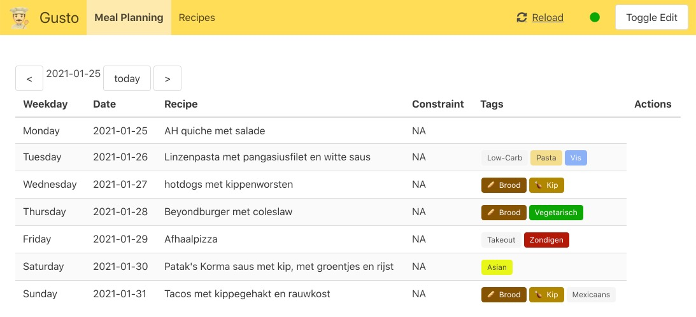
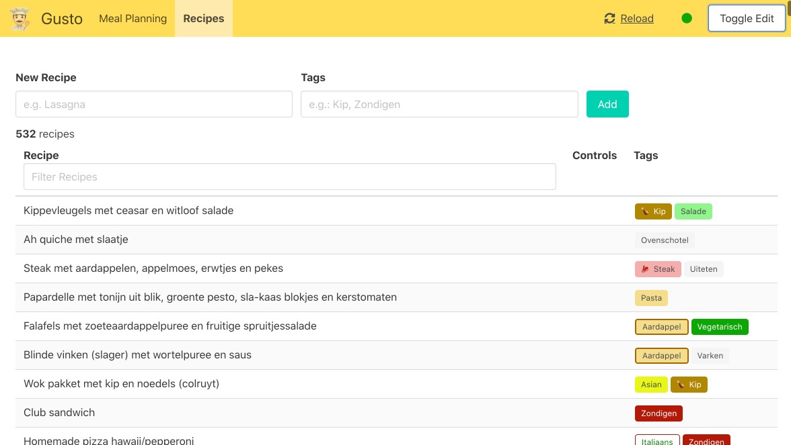

# gusto
Meal Planning tool (for personal use). **Quick-and-dirty :-)**

Currently not planning to support this for anyone but myself, but if you have interest [reach out to me on twitter](https://twitter.com/jorisroovers).

'Gusto' is a word play on [Gusteau](https://pixar.fandom.com/wiki/Auguste_Gusteau), the legendary chef from Pixar's Ratatouille movie.

<table>
    <tr>
        <td>
            <br>
            Mealplan
        </td>
        <td>
            <br>
            Recipes
        </td>
    </tr>
</table>

# Why
There are *a lot* of other meal planning tools out there. Many of these provide some of the features I'm looking for, but none provide all. My perfect meal planning app might still exists, and if it does, I'll consider switching.
Meanwhile, here's the features I'm looking for that made me decide to create my own:

- **Mealplan generation**: Generate meal plans based on self-defined constraint templates. For example: Make sure that once a week we eat fish/veggie/..., not on the same days week over week. Not too similar food 2 days in a row. Comfort food on Fridays, but not on other days. Etc.
- **Tablet Interface**: Have an interface I can display on a wall-mounted tablet (in the kitchen), that also allows for making mealplan changes quickly.
- **Custom Recipe database**: Re-using my own recipe database, compiled of easily available ingredients, food we like, easy to cook, custom tags, etc. Existing recipe databases are often not personalized enough and require quite a bit of grooming.
- **Own the data**: easily import/export/mangle recipe and meal data
- **Platform independent**: not "just" a mobile app (theres a lot of those)
- **Integrations**: Ability to integrate with [casa](https://github.com/jorisroovers/casa), my home-automation setup as well as any other systems I want (future)
- **Fun and learning**: A concrete project like this is an excellent opportunity to try out new technology

## Other Meal planning tools
These are tools I've considered/used and that didn't (fully) fit my needs
- https://www.paprikaapp.com/
- https://grocy.info/
- https://www.notion.so/ (=spreadsheet/database approach)

# Techstack
- [Starlette](https://www.starlette.io/): Python backend framework (lightweight ASGI framework/toolkit)
- [Vue.js](https://vuejs.org/): Front-end javascript framework
- [Bulma](https://bulma.io/): CSS
- 

# Usage

```sh
# Install dependencies using poetry
poetry install

poetry shell

# run webapp
uvicorn --reload --log-config config/logconfig.ini --app-dir gusto --env-file config/config-local.env gusto.web:app
```

#  Docker
```sh
docker build -t gusto:latest .
docker run --rm -d --name gusto -p 8000:80 --env-file config/config-docker.env  -v $(pwd)/config:/config -v $(pwd)/gusto.db:/data/gusto.db gusto
```

# Alembic
[Alembic](https://alembic.sqlalchemy.org/en/latest/tutorial.html) is used for Database management and migrations

```sh
# To initially setup alembic
alembic init alembic

# Run migrations
alembic upgrade head
```

# CLI 
Not updated recently, guaranteed to be broken :)
```sh
python gusto/gusto/cli.py -r $GUSTO_RECIPES -w 1
```


# TODO
- [x] Host Gusto on casa!
- [ ] Recipe Selection search based on constraint
- [ ] Constraint list export
- [ ] Export to CSV
- [x] Serve from docker containers
- [x] Store in DB
- [ ] Go forth/back a week
- [x] Show constraints names in table
- [ ] Add pictures based on slack monitoring
- [ ] Highlight today
- [x] Toggle Edit button
- [ ] Docker DEBUG logs
- [ ] Notification System
- [x] Recipe Search/filter
- [ ] Adding tags to recipes when adding new recipes
- [ ] 
